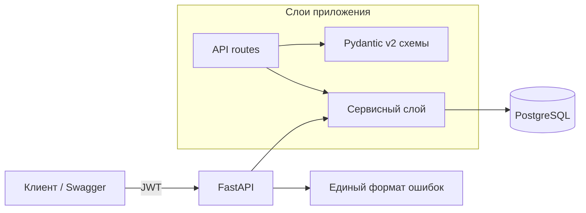

# OrderFlow Core

[](https://github.com/AlexGoster/orderflow-core/actions/workflows/ci.yml)


**REST API для обработки онлайн-заказов** — ядро платформы OrderFlow: каталог, корзина, заказы, JWT-авторизация. Проект заложил архитектурные конвенции, CI-пайплайн и PR-процесс, на которых построены остальные сервисы платформы ([jobs](https://github.com/AlexGoster/orderflow-jobs), [scale](https://github.com/AlexGoster/orderflow-scale), [services](https://github.com/AlexGoster/orderflow-services), [platform](https://github.com/AlexGoster/orderflow-platform)).

## Архитектура



- **API-слой** (`app/api`) — маршруты, DI через `Depends`, единый envelope ошибок `{"error": {code, message}}`
- **Сервисный слой** (`app/services`) — бизнес-логика, транзакции, инварианты (остатки на складе, итог заказа)
- **Домен** (`app/models.py`) — SQLAlchemy 2.0 `Mapped[]`-модели
- **Инфраструктура** (`app/core`) — конфиг (pydantic-settings), JWT (PyJWT + PBKDF2), доступ к БД

## API

| Метод | Путь | Описание |
|---|---|---|
| POST | `/api/v1/auth/register` | Регистрация (пароль — PBKDF2, 390k итераций) |
| POST | `/api/v1/auth/login` | Выдача JWT (HS256, TTL 30 мин) |
| GET | `/api/v1/auth/me` | Текущий пользователь |
| GET/POST | `/api/v1/products` | Каталог |
| POST | `/api/v1/orders` | Создание заказа (атомарное списание stock) |
| GET | `/api/v1/orders/{id}` | Заказ (доступен только владельцу — проверка 404, не 403) |
| PATCH | `/api/v1/orders/{id}/status` | Смена статуса |
| GET | `/health` | Health-check |

Полная спецификация: `/docs` (Swagger UI), `/redoc`.

## CI/CD

Пайплайн в GitHub Actions (`.github/workflows/ci.yml`) на каждый PR:

1. **Ruff lint + format check** — стиль и типовые ошибки
2. **Mypy (strict)** — статическая типизация без исключений
3. **Pytest + coverage** — unit и integration-тесты, порог покрытия в репозитории
4. **Docker build + smoke-тест** — образ собирается и отвечает на `/health`

## Разработка

```bash
git clone https://github.com/AlexGoster/orderflow-core.git
cd orderflow-core
python -m venv .venv && . .venv/bin/activate
pip install . && pip install -r requirements-dev.txt
cp .env.example .env
docker compose up -d db
alembic upgrade head
uvicorn app.main:app --reload
```

Тесты не требуют Postgres — работают на in-memory SQLite:

```bash
pytest --cov=app
```

## Тесты

- **13 тестов**, покрытие **90%**
- Integration-тесты идут через `httpx.AsyncClient` + `ASGITransport` — без сети и без БД
- Кейсы: happy-path, дубликаты (409), чужие заказы (404), нехватка stock (409), отсутствие токена (401)

## Метрики

| Метрика | Значение |
|---|---|
| Покрытие кода | 90% |
| Время CI (lint→test→docker) | ~2 мин |
| Миграции | Alembic, воспроизводимы с нуля |

## Как дальше до production

- Refresh-токены и ротация ключей (JWKS)
- OpenTelemetry-трейсы и структурные JSON-логи
- Rate limiting на auth-эндпоинты
- Blue-green деплой миграций без даунтайма

## Лицензия

[MIT](LICENSE)
